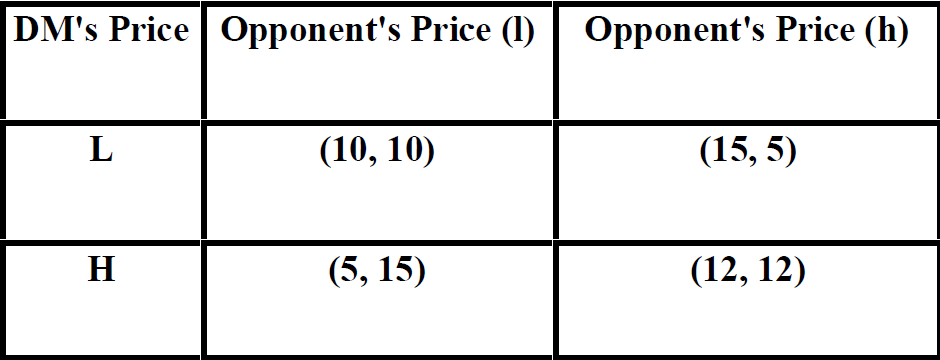
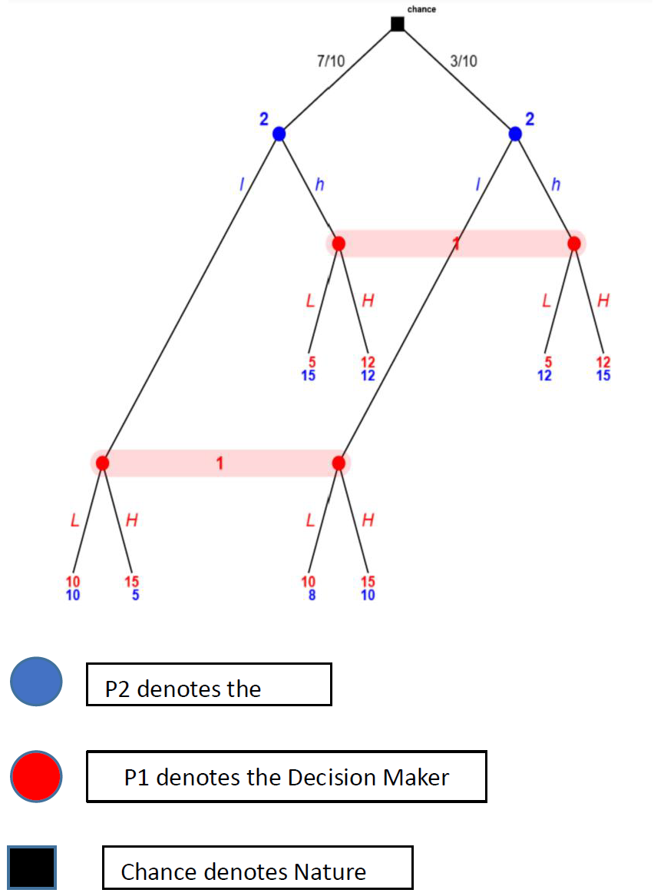

📊 Pricing Competition Under Uncertainty

🧠 Project Summary

This project models a pricing competition under uncertainty between two agents:
- Decision Maker (DM)
- Opponent (with uncertain type)

The DM aims to optimize market share and profitability, while the Opponent may be one of two types:
- Market Share Focused
- Profit Focused

Because the Decision Maker does not know the Opponent’s type with certainty, this problem is modeled as a Static Bayesian Game with Incomplete Information.
The project applies Bayesian Game Theory and determines the Bayesian Nash Equilibrium.

⚙️ The Bayesian modeling and probabilistic structure were implemented using Netica software.

🎯 Problem Statement

Both agents simultaneously choose pricing strategies

Decision Maker StrategiesL:

- L (Low Price) – Increase market share, lower margin

- H (High Price) – Higher profit margin, lower market share

Opponent Strategies

- l (Low Price) – Increase market share

- h (High Price) – Increase revenue per unit

💰 Payoff Matrices
Type 1 Opponent (Market Share Focused)

Type 2 Opponent (Profit Focused)

📐 Utility Functions

Utility functions were elicited by the Analyst.

🔵 Market Share-Focused Agent
𝑈 = 4𝑀+2𝑃

- M (Market Capitalization)

   - Same prices:
     - High = 3
     - Low = 2

  - Different prices:
    - Low = 6.5
    - High = 0.75

- P (Preference)
  - Low price = 2
  - High price = 1
    
Strong emphasis on market dominance.

🟢 Profit-Focused Agent
𝑈=2𝑀+2𝑃

- M (Market Capitalization)

   - Same prices:
    - High = 5.5
    - Low = 3

  - Different prices:
    - High = 3
    - Low = 5

- P (Preference)
  - Low price = 1
  - High price = 2

Balanced emphasis on market presence and profit margin.

🎲 Uncertainty

The Decision Maker faces probabilistic uncertainty regarding the Opponent’s type:

70% → Type 1 (Market Share Focused)
30% → Type 2 (Profit Focused)

These probabilities were derived from real-world competitive market observations and literature suggesting firms more commonly prioritize market share growth.

🧩 Strategy Sets
Decision Maker Strategies
{𝐿𝐿,𝐿𝐻,𝐻𝐿,𝐻𝐻}

Opponent Strategies
{𝑙𝑙,𝑙ℎ,ℎ𝑙,ℎℎ}

Each strategy specifies actions contingent on the Opponent’s type.

Example:
(LH, hl)

If Type 1 → DM chooses Low, Opponent chooses High
If Type 2 → DM chooses High, Opponent chooses Low

🧮 Game Tree

🏆 Nash Equilibrium

The Bayesian Nash Equilibria are:
- (LH, hh)
- (HH, hh)

Expected payoffs:
(12,12.9)

Key Insights
- The Opponent’s strategy hh (High Price for both types) is strictly dominant.
- The Decision Maker’s strategy HH is weakly dominant.
- Rational equilibrium leads both agents toward high pricing.
